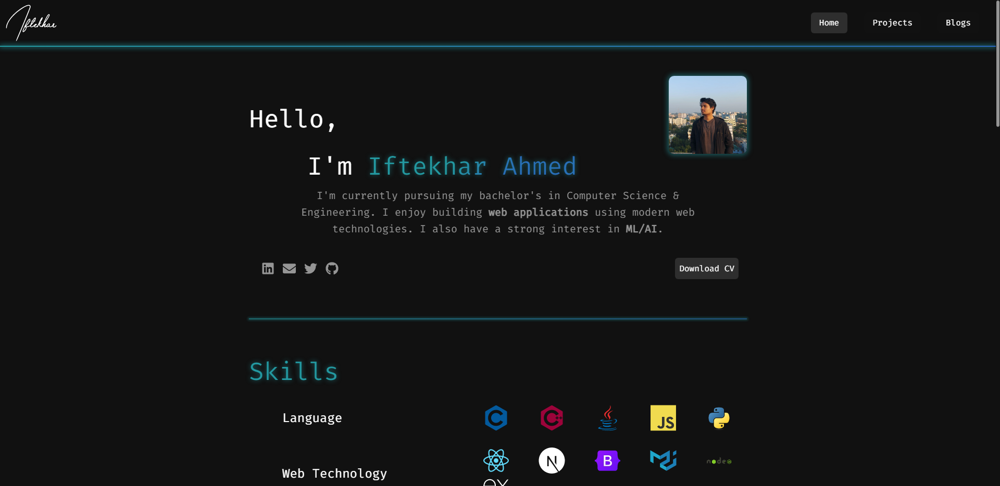

# iftekhar.vercel.app

- **Framework**: [Next.js](https://nextjs.org/)
- **CMS**: [Sanity](https://www.sanity.io/)
- **Styling**: [Tailwind CSS](https://tailwindcss.com/)
- **Deployment**: [Vercel](https://vercel.com)

## Overview

This is my portfolio website where I share my personal projects, blogs,
learnings etc.

This site is built with **Next.Js**, **Sanity.io** and **TailwindCSS**. It is
server side rendered **(SSR)** and deployed on **Vercel**
